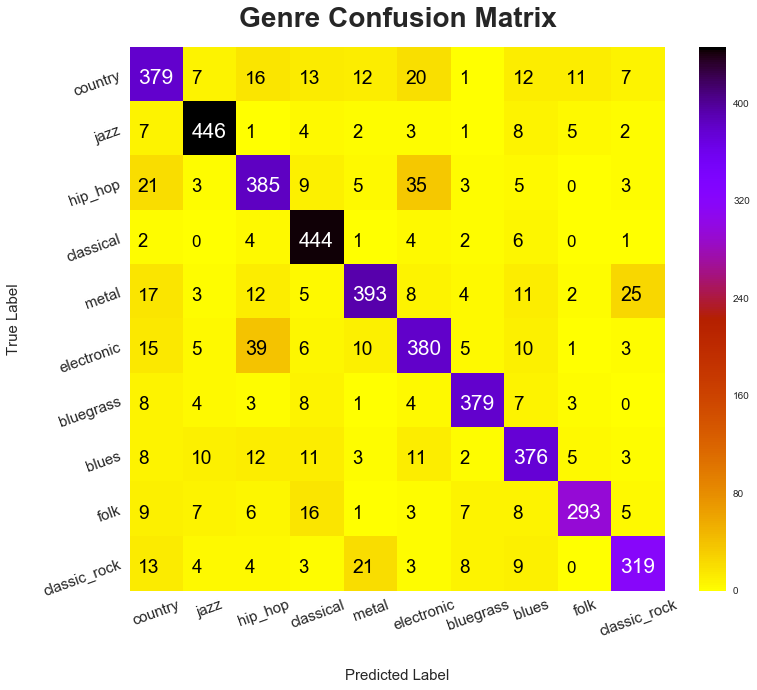
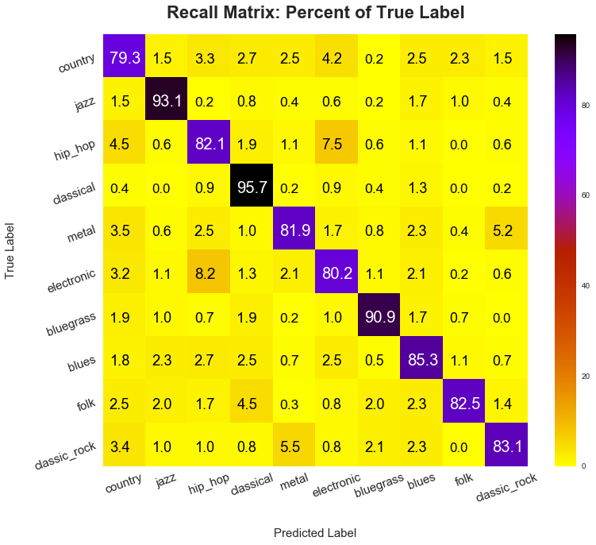
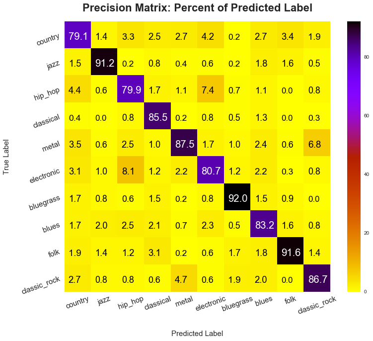

# __classify_genre__
Machine Learning Musical Genre Classification

# Business Understanding
Music is a part of most people’s lives, whether in the context of workouts, cocktails, night clubs, or TV and movies. But only certain types of music work in certain situations. I like to think of this as ‘Genre Fit’ or ‘Appropriateness’. Music isn’t just good or bad; It’s good or bad for a situation. The Game of Thrones intro is great, but it probably wouldn’t mix very well with a SitCom or a cocktail party. On a narrower spectrum, for one person’s wedding reception Country music might be great and Classical would be uncomfortable. For a different person’s wedding reception the opposite might be true. Luckily we often have Genre labels for music. What about new music? Likely artists will self report the genre. But what if a Folk artist produces a Jazz song? Or what we want to find the Folk songs that are also Jazz, but some of them are labeled as Folk and some of them are labeled as Jazz? Or for another genres example, what if we wanted to find new Country music that is no way Hip Hop? If we can predict the likelihood that a song falls into certain genres we can answer these questions.

# Data Understaning
__Collection__- For this experiment, about 100 songs worth of data are collect from each genre. In total 10 genres are collected. This experiment is intended to be quickly repeatable with different mixes and numbers of genres of music. So If you’d like to re-run this experiment with different genres, you can just replace the playlist urls with other playlists and genre labels.  
In a previous experiment, 6 genres were collected and will joined with new features.

For each genre a playlist on youtube is selected, such as a ‘Top 100 country’, effectively pre-labeling the data. The urls to each song are collected using BeautifulSoup. Then for each song, the audio file is retrieved using the youtube_dl library. The audio file is then loaded as 1d numpy array, using the librosa audio library. If the song is longer than 4 minutes only the first 4 minutes are loaded. The song’s audio is then chopped into 10-second pieces for a more granular examination of the sounds present. Librosa is then used to extract features such as tempo, spectral centroid, spectral rolloff, zero crossing rate and mel frequency cepstral coefficients. These terms are very jargon-ey but in essence, they represent parts of the timbre of a sound. They are then averaged over their 10-second intervals to create 1 data point per feature. The features are then stored in a json with the genre label and one row for each 10-second chunk in the song. The audio file is then erased before moving on to the next song. The same process is repeated for each song of each genre.

Mfcc's 9 and 11 eleven appear to have the least distinct distributions among genres.

# Data Preparation

The data is split into 64%/16%/20% train, test and validation sets and stratified to maintain an consistent distribution of genres among sets.

Principal Component Analysis is applied before Boosted Forest models due to a performance increase in an earlier trial.

Power Transformation is applied before Support Vector models.

A DataFrameMapper is applied to test dropping features mfcc9 and mfcc11. 

# Modeling

A Support Vector Classifier predicts the test set with a log loss of 0.54 and average Jaccard score of 0.72.

A Gradient Boosted Trees Classifer predicts the test set with a log loss of 0.73 and average Jaccard score of 0.62.

As in earlier trials the Support Vector performs better.

The Support Vector Classifier which drops mfcc's 9 and 11 predicts the test set with a log loss of 0.60 and average Jaccard score of 0.69.

The Support Vector Classifier is grid searched and the best parameters run are:

{'model__C': 8,
 'model__decision_function_shape': 'ovr',
 'model__gamma': 0.25,
 'model__tol': 0.0001}
The grid search does not improve performance significantly.
The grid search model is trained to reduce log loss and log loss improves by a mere 0.0006 and Jaccard score actually worsens by 0.002

# Evaluation

The Support Vector Classifier predicts the validation set with log loss of 0.48 and Jaccard score of 0.75. The accuracy of the predictions is 0.85.
Below is a confusion matrix as well as the recall and precision of the predictions visualized over confusion matrices.

# Deployment
The model is pickled and deployed to a flask app.
The flask app is deployed on an AWS server which will be updated soon!